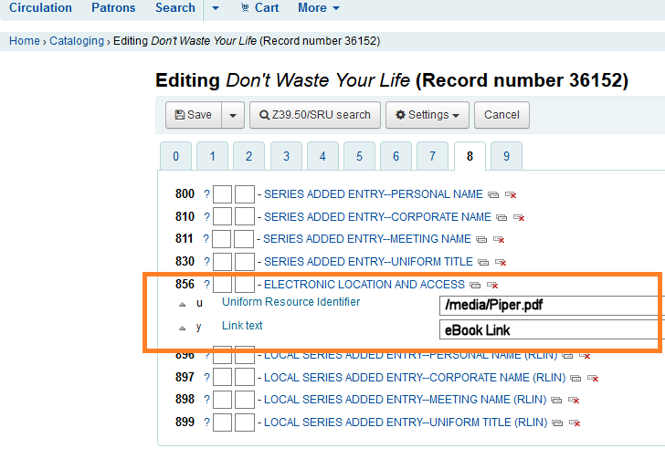

# connectbox_koha_installer

This is a script for installing KOHA library system onto a ConnectBox RPi image.  Things you will need:

* Raspberry Pi 3b+
* microSD card that is a Class 10 device.  Depending on the size of your library, you might need something large. However, the ConnectBox image and the KOHA software can easily fit onto a 4Gb drive.
* A LAN cable that goes into a hub/switch and that access to the internet.  This needs to be plugged into the LAN port of the RPi.
* A standard USB drive of pretty much any size that will be plugged into the back of the RPi.
* Optional - a monitor and keyboard which helps with just being able to watch things. You can see the RPi boot up and type into the console. Not necessary but handy.

## Preparing the OS

Download and burn onto your microSD card the latest version of ConnectBox OS for the RPi. This script has been tested against the [20181021](https://github.com/ConnectBox/connectbox-pi/releases/tag/v20181021) RPi image. If there is a more current RPi release (not the NanoPi NEO versions) [ConnectBox Releases](https://github.com/ConnectBox/connectbox-pi/releases/), this script has not been tested agains them. I fully expect it to still work but your mileage may vary so be warned.

Once you download the image, use Etcher [Etcher](https://www.balena.io/etcher/) which has a version for just about every desktop platform. It should be obvious on how to write the image but the leftmost button (Select Image) is used to pick the image file (Raspberry-Pi_v20181021.img.xz) and the middle button is used to pick the mounted microSD card.  Click the Flash button to write the image to the drive. Note: Etcher uses the entire microSD card when it writes the image so be sure that nothing important is on that drive.


Insert the completed microSD card into the RPi _but do not start the RPi up yet_.

## Preparing the External USB Stick

By default, your ConnectBox has SSH disabled over the LAN port. It is relatively simple to turn it on. Essentially, you need to create a specifically named directory and a file in that directory on your external USB stick. Have it inserted, then boot the device. The ConnectBox will automatically see those items and thereby enable SSH support over the LAN. The folder must be named:

`.connectbox` (in all lowercase and with the preceeding period)

Inside that folder, you will need to put a file called: enable-ssh again without the quotes. The file can contain information or be blank.

Under Windows, the Operating System won’t let you make folders that start with a period so you need to do something a bit different. Open up a Command Prompt, (hold down the `WINDOWS-R` keys and a window will pop open. Type `cmd` into it and hit the OK button). From the terminal window, go to your USB drive by typing in the following:

`D:` where D: is the drive letter of your external USB stick.

Then type `mkdir .connectbox` which will allow you to make that special folder with the period in the front of the name. Follow this with the command `cd .connectbox` to move inside of that folder. Then make the file with the command `type nul >enable-ssh`.  You can use the `dir` command to verify that the file has been made. That is all there is to doing that under Windows.


## Starting your RPi

With both the microSD card and the external USB stick inserted into the RPi and the LAN cable connected, connect power to the RPi and let it boot up. On first boot, the system will do things like resize the file system and initialize a few things. If you have a monitor connected you can watch the system do those things and reboot itself. If you don't have a monitor, just wait a full minute before trying to network in via SSH. Once the RPi boots, if you look for WiFi networks on your phone, you should see the "ConnectBox - Free WiFi" SSID available showing that the unit is up and running as a full ConnectBox device.


## Connecting to the RPi over SSH

On Windows, you can use PuTTY [PuTTY](https://www.chiark.greenend.org.uk/~sgtatham/putty/latest.html) or if you have Windows 10, you can install the _Linux Bash Shell_ subsystem onto your computer. Either way works just fine.

The first step is to determine what is the IP address of the RPi on your network. I find that the easiest way is to use the "Advanced IP Scanner" tool to scan the network and see what is on the network. [Advanced IP Scanner](http://www.advanced-ip-scanner.com). The ConnectBox is setup to use the DHCP of whatever network that it connects to so as long as your desktop/laptop are on the same network together, the program will detect and find it.


It is easy to see which one is the Raspberry Pi on the network using this tool. Not only do you see the Manufacturer as "Raspberry Pi Foundation" but also if you click on the left detail arrow, you can see that the unit has a webserver running with the naming convention of "Connected to ConnectBox WiFi". Obtain the IP address for the RPi off of this scan tool (in our case it is 192.168.88.69).

For the rest of this guide, we will use the Window's 10 Linux Subsystem to demonstrate the commands for KOHA installation.

We will need to connect to the RPi via SSH, open up the Linux Subsystem and get to a command prompt. One problem that may encounter is that the RPi will initially refuse the SSH connection. This is because the RPi needs to either login via the attached keyboard and monitor first -or- more simply, just turn the RPi off and then back on. On the second boot, you will be able to connect in from your remote desktop.

The syntax for connecting is: `ssh root@<the RRi's ip address>` So in our case, that looks like: `ssh root@192.168.88.69`

### ConnectBox SSH Login Credentials:

username: *root*

password: *connectbox*


_Note: you probably will get a warning the first time you connect that you need to accept the SSL certificate. If so, just say yes and agree._

## Installing KOHA

Once inside the RPi, type/paste in the below instructions:


```bash
curl -O https://raw.githubusercontent.com/GeoDirk/connectbox_koha_installer/master/cb_koha_installer_script.sh

chmod 755 cb_koha_installer_script.sh

./cb_koha_installer_script.sh | tee koha_install.log
```

Sit back and wait an hour or so for the script to run full. The better the microSD card, the faster the script will run. After that, connect using the web to `http:\\<the RRi's ip address>:8080` which is the admin port.  Using the new username and password shown at the end of the script window, log in and complete the KOHA setup usng the web installer. Yours will be slightly different, but here is what mine looks like:

```
==================================================================
   K O H A    I N S T A L L   S C R I P T    C O M P L E T E D
       elapsed:  57 minutes and 3 seconds
==================================================================
  Open up a web browser and walk throught the installer
  http://192.168.88.69:8080
  Username: koha_library
  Password: g9sp0jz6VskxLBRq
```

## Configuring KOHA Via a Web Browser

Launch your web browser and navigate to the URL referenced at the end of the installer script. Put in the username `koha_library` and the password that it generated.


After that, you will be presented with a few more screens:

* Choose your language (leave it as `EN` if you want English otherwise pick whatever is appropriate)
* Check Perl dependencies (just click Continue)
* Database Settings (just click Continue twice)
* Set up database (just click Continue and wait a bit while the database is initialized - it will take some time so just wait)
* Success (just click Continue twice)
* Install basic configuration settings (just click Continue)
* Select your MARC flavor (leave it as using Marc21)
* Selecting default settings
  * Under "Optional", click "Select all"
  * Under "Other data" / "Optional", enable "Sample patron types and categories.", "A set of default item types.", and "Allow access to the following servers to search and download record information:". Then click "Import". Wait again while it configures and adds in the requested items.


* Default data loaded (Click on the "Set up some of Koha's basic requirements")
* Installation complete (will redirect in 10 seconds)
* Create a library (This is where you put in whatever library you want to create. For this demo since I'm importing an existing library, I'll be putting in some specific values.  But put in your values here.)


* Create Koha administrator patron (Again, this is where you put in YOUR items.)


* Create a new circulation rule (set your rules accordingly)
* Complete (Press the "Start using Koha" button to continue)

You now need to login using the administrator login credentials you created above. Administrative login is always on port `8080`


Any patrons that you add will access the KOHA website using the standard port `80` which means that you just leave it off and just put in the RPi's IP address.


## Importing an existing library into KOHA

If you want to import an existing library into your RPi, you can use the command line once again to do this easily. In my case, I have a library export called `saiacskoha.mrc` in Marc21 format. Using the `scp` command, you can transfer that from your desktop machine over to the RPi. _Note: if you are still inside the command prompt from the install, you'll need to first type in `exit` to bring your prompt back over to the desktop environment._

`scp /mnt/d/Projects-KOHA/Sample\ Data\ Files/saiacskoha.mrc root@192.168.88.69:/root`

_Where:_
    * `/mnt/d/Projects-KOHA/Sample\ Data\ Files/saiacskoha.mrc` is the file located on my Window's drive here: `D:\Projects-KOHA\Sample Data Files\saiacskoha.mrc`
    * `root@192.168.88.69:/root` is the username and IP address for the RPi with the `:/root` ending being the directory on the RPi where we want to transfer the file into.

Once the file is copied over, we need to import the records. Enter in the following commands:

```bash
ssh root@<your RPi IP address here>
cd /root
export KOHA_CONF=/etc/koha/sites/library/koha-conf.xml
perl /usr/share/koha/bin/migration_tools/bulkmarcimport.pl -d -commit 500 -file /root/saiacskoha.mrc
```

This once again takes a long time depending on the library size...


## Referencing eBooks in KOHA

With the ConnectBox OS, it is partitioned so that on the internal microSD card for the RPi there is an internal folder called `/media/usb0` where you can put your media.  If there is an external USB attached to the RPi, it will show the contents of that device instead of the internal directory on the microSD card.  So depending on how you want to distribute your eBooks, you can either :

* Put them onto the internal /media/usb0 directory first and then burn all the microSD cards.  This would likely be a bit cheaper than having a second attached USB stick with the eBooks.
* Put them onto an attached USB stick.

With the above install script, the web server now has access to port 8082 which points to that `/media/usb0` directory.  This means that I can put a PDF (or whatever format) book in there and access it from the web.  For example, I put the book called Piper.pdf into that /media/usb0 directory.  I can now access it by going to the URL: http://192.168.88.69:8082/Piper.pdf (where 192.168.88.69 is the default IP address for the RPi and port 8082 is the portal into that `/media/usb0` directory).  So in KOHA, as you define/add in this book to the library, you add in that URL to the `856$u` (Uniform Resource Identifier) sub category and in `856$y` (Link Text) sub category, you add in whatever descriptive text that you want that will show up for the user.  In the below example, I put in "eBook Link" but whatever you want.



Then from the search window, the results of searching for that John Piper book comes up like this:


The first book returned is the one that is the physical book. The second one is the one I added in like above. The "eBook Link" is the clickable URL link.  Click it and this pops up in a new browser window:


